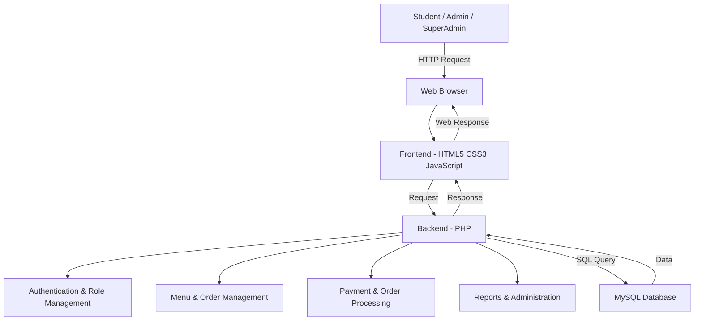

# Architecture

## System Architecture

[Describe the overall architecture of your system. Replace the Mermaid diagram below with your actual architecture.]

## Components

| Component | Technology | Responsibility |
|---|---|---|
| User Interface | HTML5, CSS3, JavaScript | Web pages, menu display, cart, checkout, dashboards and user interaction |
| Backend | PHP |  Business logic, authentication, order processing, payment handling and administration |
| Email Service | PHPMailer | Sends email notifications where required |
| Database | MySQL | Stores users, canteens, menu items, orders, order details and payment records |
| Version Control | GitHub | Source code management and team collaboration |

## Data Flow

[Describe how data moves through your system from input to output.]

1. The student, Admin, or SuperAdmin accesses the system through a web browser.
2. The frontend provides interfaces for login, menu browsing, ordering, administration and reports.
3. User requests are sent to the PHP backend running on the Apache/XAMPP server.
4. The backend authenticates the user and checks the user's role and permissions.
5. Students can browse available menu items, select quantities, add items to the cart and place a pre-order.
6. Order and payment-related information is processed by the PHP backend.
7. The backend stores and retrieves information from the MySQL database.
8. Admin and SuperAdmin can manage users, menu items, orders, payments and system activities.
9. The processed result is returned to the frontend and displayed to the user.

## Security Considerations

[Note any security decisions relevant to the architecture — even if basic.]

- User authentication is implemented for controlled access to the system.
- Role-based access is used to separate Student, Admin and SuperAdmin functionality.
- Passwords are stored using encrypted/hashed password handling.
- Database credentials should be kept outside publicly accessible source code.
- Sensitive configuration values should be stored using environment/configuration files and should not be committed to GitHub.
- Payment proof and user information should only be accessible to authorized users.
  
## Scalability Notes

[Optional: how would this scale beyond the hackathon prototype?]
